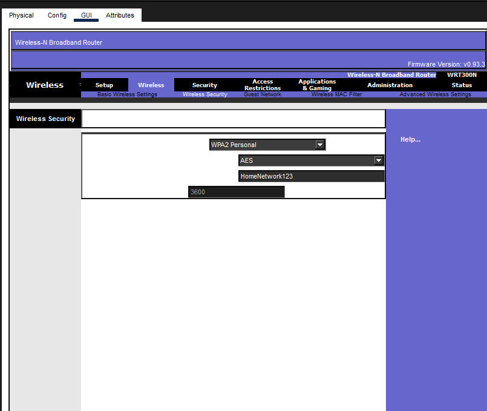
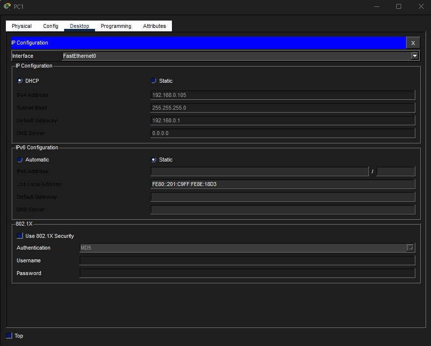
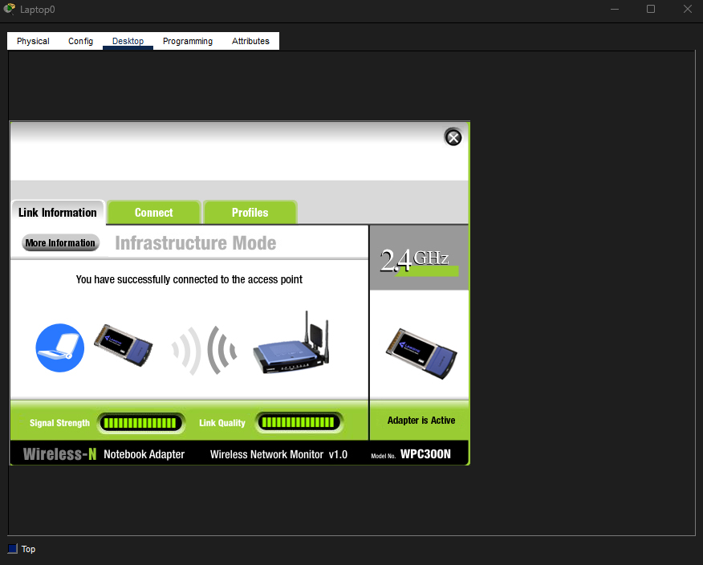

# Setup Guide: Home Network Configuration

## Step 1: Router Configuration
1. Access router GUI interface
2. Configure basic wireless settings:
   - SSID: MyHomeWifi
   - Band: Mixed
   - Channel: Auto
3. Set wireless security:
   - Security Mode: WPA2-Personal
   - Passphrase: HomeNetwork123

## Step 2: Device Configuration
### Wired PCs (PC0 & PC1)
- Set IP configuration to DHCP
- Verify automatic IP assignment
- Confirm gateway is 192.168.0.1

### Wireless Devices
**Laptop:**
- Install wireless adapter
- Connect to MyHomeWifi SSID
- Enter WPA2 passphrase

**Smartphone:**
- Scan for wireless networks
- Select MyHomeWifi
- Configure WPA2 security

## Step 3: Connectivity Testing
1. Open command prompt on PCs
2. Ping router: `ping 192.168.0.1`
3. Ping between devices: `ping 192.168.0.104` / `ping 192.168.0.105`
4. Verify 0% packet loss

## Step 4: Verification
- Check all link lights are green
- Confirm IP addresses are assigned
- Test internet connectivity (if cloud configured)
- Verify wireless association status